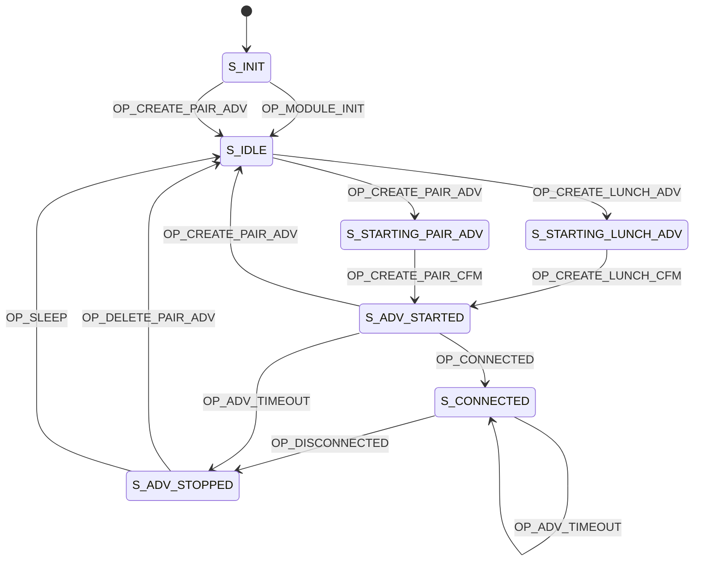

## What is this?

A "fastrak" for lunch lines aimed to get rid of lines. You put the device in your backpack, and then walk through the door without needing to scan or type your student id code.

## Notes

Add the following files to FIXME_EXAMPLE_USES_BLE in app.mk

```
FIXME_EXAMPLE_USES_BLE := \
 lunch_beacon.c \
 lunch_button.c \
 lunch_nvds.c \
 lunch_gatt.c \
```

## State Diagram


