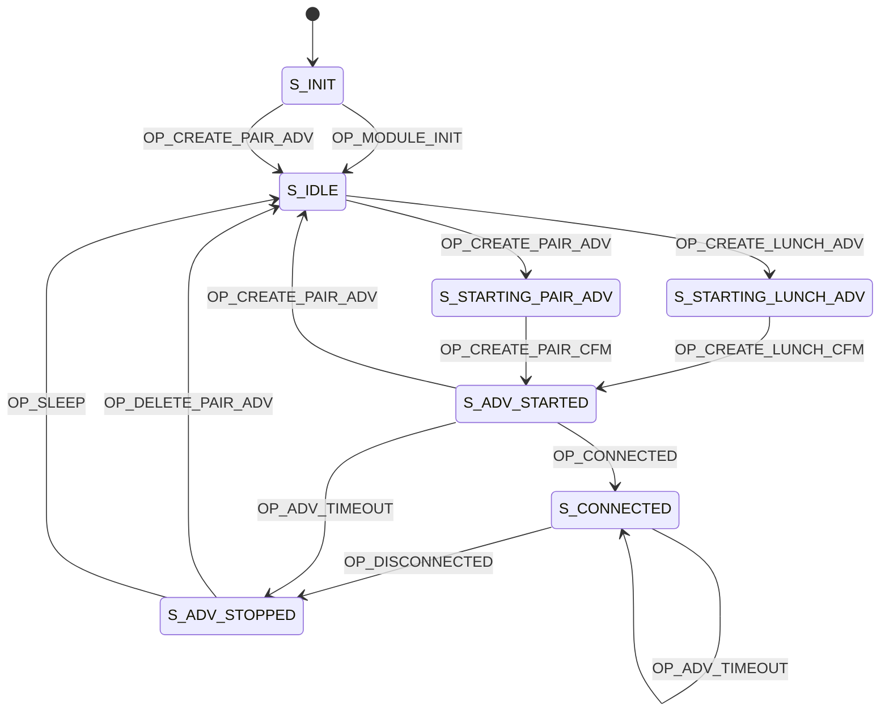

## What is LunchTrak?

LunchTrak is a "fastrak" system aimed to shorten the incredibly long school lunch lines. Students will be scanned in automatically without having to stop and type/scan their ID number. This change will allow the line to flow much quicker, letting students get to their clubs and events on time.

## How Does the Beacon Work?

The LunchTrak beacon is what will be inside of the students backpack. When they first receive them, they can enter pair mode by pressing the pair button for 3 seconds. They can then connect to with the LunchTrak website to configure their student ID.

Most of the time, the device will be in hibernate mode to conserve energy. Near the lunch line, a wakeup signal will be emitted to wake up the device, and the device will start beaconing for a couple minutes with information about the student's school and ID number.

## Setup Locally

You'll need the Atmosic SDK, though I'm not sure if that is publically avaliable. Place this repo such that the path is as follows:

atmosic_sdk/platform/atm2/ATM22xx-x1x/examples/lunch_beacon

### Build options

```bash
# Compile
make

# Compile and Program
make run_all
```

### Workaround

There is a necessary workaround as of April 2023 where you'll need to include the following lines to FIXME_EXAMPLE_USES_BLE in app.mk

```makefile
FIXME_EXAMPLE_USES_BLE := \
 lunch_beacon.c \
 lunch_button.c \
 lunch_nvds.c \
 lunch_gatt.c \
```

## State Diagram


